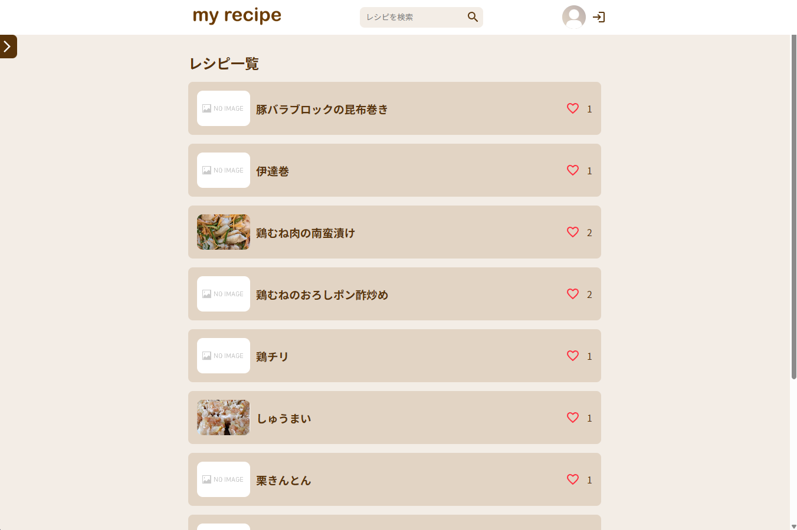
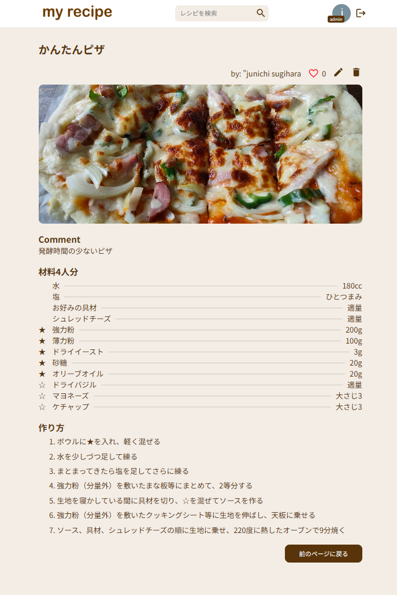
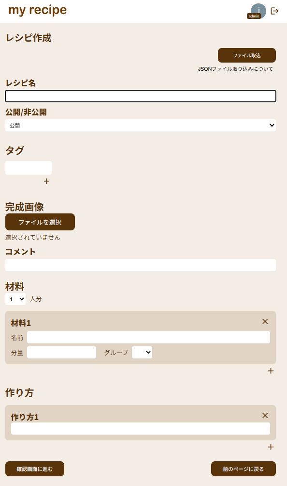

# My Recipe App

React + TypeScript + Redux Toolkit + Firebase を使用して作成した  
レシピ管理アプリです。  
レシピの登録・編集・検索・お気に入り管理などができます。
IT初心者に扱いやすいようにgoogleアカウントのみで軽易にログインできるよう設計しております。
家族、知り合い等の少ないコミュニティでの運用を想定しており、実際に家族で運用しています。

---

## デモ

https://my-recipe-with-redux-and-ts.web.app

---

## アプリ概要

このアプリは以下の学習目的で作成しました。

- React + TypeScript の実践
- Redux Toolkit を用いた状態管理
- Firebase Authentication / Firestore を使ったバックエンド連携
- SPA（Single Page Application）の設計

---

## 主な機能

- レシピ一覧表示
- レシピ詳細表示
- レシピ作成 / 編集 / 削除
- お気に入り登録
- レシピ検索
- ページネーション
- JSONインポート
- Firebase Authenticationによるログイン

---

## 使用技術

### フロントエンド

- React
- TypeScript
- Redux Toolkit
- React Router
- Material UI

### バックエンド / インフラ

- Firebase Authentication
- Firestore
- Firebase Hosting

---

## 画面イメージ

### レシピ一覧



### レシピ詳細



### レシピ編集



---

## ディレクトリ構成

```
src/
 ├ components
 ├ hooks
 ├ store
 ├ services
 ├ types
 └ utils
```

- **Redux Toolkit** による状態管理
- **Custom Hooks** によるロジック分離
- **Firestore** によるデータ管理

---

## 開発環境のセットアップ

### 依存関係のインストール

```
npm install
```

### 開発サーバー起動

```
npm run dev
```

### ビルド

```
npm run build
```

---

## デプロイ

Firebase Hosting を使用しています。

```
firebase deploy
```

---

## 今後の改善予定

- タグ検索
- カスタムフック整理
- テストコード追加
